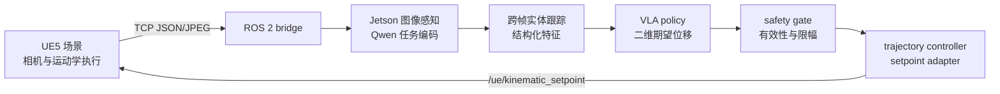

# ASV 硬件在环仿真平台

这是面向具身智能与无人船控制岗位的项目总览仓库。它负责说明系统架构、论文关联和演示入口；各子项目源码分别维护在独立仓库中。

## 项目组成

| 子系统 | 独立项目 | 责任 |
| --- | --- | --- |
| UE5 仿真端 | [`asv-unreal-simulation`](https://github.com/EnjunLiu/asv-unreal-simulation) | 场景、相机、目标实体、TCP 运动学执行 |
| PC 训练端 | [`asv-vla-training`](https://github.com/EnjunLiu/asv-vla-training) | 数据集整理、特征缓存、策略训练和离线评估 |
| Jetson VLA 端 | [`asv-jetson-ws`](https://github.com/EnjunLiu/asv-jetson-ws) | ROS 2 bridge、图像感知、语言编码、策略、安全门和控制器 |
| ESP32 控制端 | [`asv-esp32-firmware`](https://github.com/EnjunLiu/asv-esp32-firmware) | ESP-IDF/micro-ROS 控制、执行器接口和超时保护 |

总仓库不作为各端源码的第二个权威副本。

## 软件 HIL 闭环

本项目当前面向面试展示的闭环边界是 UE5 与 Jetson 之间的软件 HIL：

在线策略输入是相机图像、任务指令、结构化实体几何、上一动作和有效性掩码；输出是 body-frame 下的二维期望位移（米），不是推进器 PWM。`/ue/entities` 只用于采集和离线监督，不能作为在线 privileged truth。

ESP32 是独立的真实控制链路，不由上述软件 HIL launch 自动启动。需要物理执行闭环时，按 ESP32 独立项目的说明接入控制器和 micro-ROS 链路。

## 演示与论文

- 演示视频：待补充公开链接；仓库只保留封面图或小型 GIF，不提交大视频文件。
- 论文关联：该仿真、数据采集和控制链路支撑本人四篇论文中的实验工作。
- 工程重点：ROS 2 多节点通信、图像条件感知、结构化决策、安全门、UE5 TCP bridge、ESP-IDF 控制和可复现实验边界。

## 如何使用

1. 进入对应独立项目，按其 README 安装依赖并构建。
2. Jetson 软件 HIL 需要准备外部模型目录，并在 Jetson 项目中运行 `vla_closed_loop.launch.py`。
3. PC 端启动 UE5 `Main_Map`，将 TCP 执行端口配置为 `8081`，再启动 Jetson launch。
4. 真实 Jetson CUDA 加载、UE5 TCP 联调和同次运行日志属于设备级验收，不能用 PC 单元测试替代。

## 仓库边界

训练代码、数据集、模型权重、缓存、ROS `build/install/log`、UE5 生成目录和设备凭据均不提交到总仓库。总仓库只维护项目叙事和入口；各独立仓库维护各自可运行源码。
