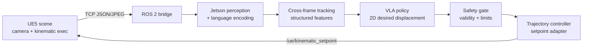

# ASV HIL Platform

Software-in-the-loop platform for vision-language-action (VLA) control of an autonomous surface vehicle (ASV). A UE5 scene provides camera and kinematic execution; a Jetson Orin runs ROS 2 perception, language encoding, policy inference, and safety-gated setpoints over TCP.

This repository is the **portfolio entry point**. Source of truth for each subsystem lives in its own repo—do not treat this tree as a second code mirror.

## Subsystems

| Subsystem | Repository | Role |
| --- | --- | --- |
| UE5 simulation | [`asv-unreal-simulation`](https://github.com/EnjunLiu/asv-unreal-simulation) | Scene, cameras, target entities, TCP kinematic execution |
| PC training | [`asv-vla-training`](https://github.com/EnjunLiu/asv-vla-training) | Episode tooling, feature caches, policy / perception training, offline eval |
| Jetson runtime | [`asv-jetson-ws`](https://github.com/EnjunLiu/asv-jetson-ws) | ROS 2 bridge, image perception, language encoder, policy, safety gate, controller |
| ESP32 firmware | [`asv-esp32-firmware`](https://github.com/EnjunLiu/asv-esp32-firmware) | ESP-IDF / micro-ROS actuators and timeout protection (physical path) |

## Software HIL loop

The default closed loop is **UE5 ↔ Jetson** (software HIL). ESP32 is a separate physical control path and is not started by the software HIL launch.

**Online contract**

- Inputs: camera image, task instruction, structured entity geometry, previous action, validity mask
- Output: body-frame desired displacement `[dx, dy]` in meters (not thruster PWM)
- `/ue/entities` is for logging / offline supervision only—not online privileged truth

## Quick start

1. Build and configure each subsystem from its own README.
2. On Jetson, place models under the configured `models_dir` and launch `vla_closed_loop.launch.py`.
3. On the PC, start UE5 `Main_Map` with SceneExec listening on `8081`, then connect the Jetson bridge (`0.0.0.0:8080`).
4. Treat real CUDA load, TCP bring-up, and same-run logs as device-level acceptance. Host unit tests do not replace that.

Typical software HIL tasks: follow a colored target boat at a commanded standoff (e.g. 3 m / 4 m).

## Repository boundaries

Not committed here (or into subsystem repos unless that repo explicitly documents it):

- Training datasets, episode dumps, large caches
- Model weights and embedding tables (ship via your own artifact channel)
- ROS `build/` / `install/` / `log/`
- UE5 `Binaries/`, `Intermediate/`, `Saved/`, DerivedDataCache
- Device credentials and private keys

This repo keeps architecture, subsystem links, and the HIL contract. Each independent repo owns runnable source and its operational docs.

## License

See [LICENSE](LICENSE).
